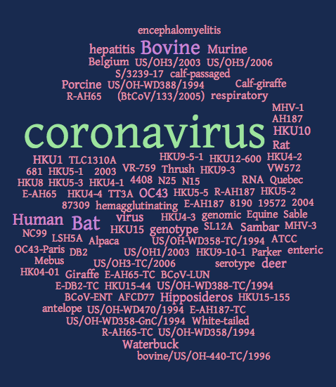

This is a Python program to display word clouds based on the titles that
are matched by [BLAST](https://en.wikipedia.org/wiki/BLAST).



## Usage

First, run `blast` and use `-outfmt 5` on the command line to get XML
output. Let's suppose that's in a file called `blast-output.xml`. Then:

```sh
$ blast-wordcloud.py --in blast-output.xml --out word-cloud.png
```

In this example, your word cloud image will be saved to `word-cloud.png`.

If the BLAST database you're matching against was downloaded from NCBI,
you'll likely find the `--ncbiTitles` option useful. That will transform an
NCBI sequence title like "gi|361057412|gb|CP003178.1| Niastella koreensis,
complete genome" into "Niastella koreensis". It uses a simple heuristic -
only keep the text between the first space and the first comma in the
title, but it is quite effective.

## Installing under Linux

You'll need Python installed, which should already be the case. You might
want to make a [virtualenv](https://pypi.python.org/pypi/virtualenv) for
the installation (otherwise you'll need to run the following using `sudo`,
which isn't recommended).

Firstly `pip install -r requirements.txt`.

Then install Pygame [from here](http://www.pygame.org/download.shtml).

## Installing pygame under Mac OS X

You'll need Python installed, which should already be the case. You might
want to make a [virtualenv](https://pypi.python.org/pypi/virtualenv) for
the installation (otherwise you'll need to run the following using `sudo`,
which isn't recommended).

Firstly, `pip install -r requirements.txt`.

This is a bit awkward, and I haven't managed to make it work.  I have
brew's X11 installed, and I did the following:

* Download and unpack the pygame 1.9.1 sources from
  [here](http://www.pygame.org/download.shtml)

* `$ python setup.py install`

* This fails on a compile (unable to find `X11/Xlib.h`). Edit the `Setup`
  file that was created by the failed install, and add `-I/opt/X11/include`
  to the end of the `SDL = ...` line at the top.

* Edit `src/scale_mmx64.c` and change the two instances of `movsxl` to be
  `movslq`
  [see here](http://stackoverflow.com/questions/11954497/error-when-installing-pygame-on-mountain-lion)
  for some details on that.

* For Python 2.7 I had to run `$ sudo mkdir
  ~/.virtualenvs/lm/include/python2.7/pygame` and `$ sudo chown $USER
  ~/.virtualenvs/lm/include/python2.7/pygame`. That's because the Brew
  python 2.x links to the system python, so the above directory is actually
  in `/System/Library/Frameworks/Python.framework/Versions/2.7`.

* Re-run `$ python setup install`. If all goes well you should then be able
  to cleanly run `$ python -c 'import pygame'`.

### Problem under Python 2

Although pygame can now be imported, it doesn't fully work. Under Python2 I
get an error from `pygame.font.init()`:

```
$ python
Python 2.7.10 (default, Jul 14 2015, 19:46:27)
[GCC 4.2.1 Compatible Apple LLVM 6.0 (clang-600.0.39)] on darwin
Type "help", "copyright", "credits" or "license" for more information.
Jedi is not installed, falling back to readline
>>> import pygame
>>> pygame.init()
/Users/terry/.virtualenvs/lm/lib/python2.7/site-packages/pygame/pkgdata.py:27: UserWarning: Module pygame was already imported from /Users/terry/.virtualenvs/lm/lib/python2.7/site-packages/pygame/__init__.pyc, but /private/tmp/pygame-1.9.1release is being added to sys.path
  from pkg_resources import resource_stream, resource_exists
(4, 0)
>>> pygame.font.init()
__main__:1: RuntimeWarning: use font: No module named font
(ImportError: No module named font)
Traceback (most recent call last):
  File "<stdin>", line 1, in <module>
  File "/Users/terry/.virtualenvs/lm/lib/python2.7/site-packages/pygame/__init__.py", line 70, in __getattr__
    raise NotImplementedError(MissingPygameModule)
NotImplementedError: font module not available
(ImportError: No module named font)
```

There are some pages on the web that implicate a mix of 32-bit and 64-bit
Python for the above, but I don't know how any 32-bit stuff can be
happening on my machine.

Unfortunately, `pytagcloud` makes heavy use of `pygame` (at least it
imports many things).

### Problem under Python 3

Under Python 3.5 there is a different error:

```
$ python -c 'import pygame'
Traceback (most recent call last):
  File "<string>", line 1, in <module>
  File "/Users/terry/.virtualenvs/lm35/lib/python3.5/site-packages/pygame/__init__.py", line 95, in <module>
    from pygame.base import *
ImportError: dlopen(/Users/terry/.virtualenvs/lm35/lib/python3.5/site-packages/pygame/base.cpython-35m-darwin.so, 2): Symbol not found: _PyCObject_AsVoidPtr
  Referenced from: /Users/terry/.virtualenvs/lm35/lib/python3.5/site-packages/pygame/base.cpython-35m-darwin.so
  Expected in: flat namespace
 in /Users/terry/.virtualenvs/lm35/lib/python3.5/site-packages/pygame/base.cpython-35m-darwin.so
```

I'm not sure what's going on here, but have checked to make sure
`base.cpython-35m-darwin.so` exists (it does) and that it doesn't contain
`_PyCObject_AsVoidPtr` (it doesn't - you can check with `nm -a`).

Some googling is required, I guess. But we may never get there on modern
Mac OS X. The last release of pygame was from 2009 :-(
